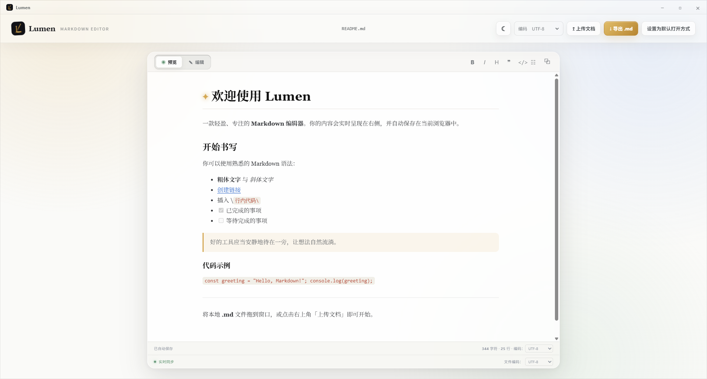

<div align="center">


# Lumen Markdown

**让想法自然流淌。**

一个轻量、专注、注重隐私的 Markdown 编辑器，支持实时预览与 Windows 桌面端使用。

<p>
  
  
  
</p>

</div>



## 产品理念

Lumen 的名字来自“微光”。它不是一个试图占据注意力的复杂工作台，而是一盏放在文字旁边的小灯：足够清晰，却不会打扰思考。

我们希望编辑器做到三件事：

- **安静**：让工具退后，让内容向前。
- **可靠**：打开、编辑、预览和导出都保持简单直接。
- **私密**：文档默认只保存在本地，不要求登录，也不主动上传内容。

## 功能亮点

- Markdown 编辑与实时预览
- 编辑、预览和并列模式切换；并列模式下左右滚动实时同步
- 粗体、斜体、标题、引用、行内代码和列表快捷工具栏
- 代码块、表格、任务列表、图片和链接等常用语法
- 自动识别并渲染 `http://`、`https://`、`www.` 蓝色超链接
- 支持本地文件路径和相对路径链接，并使用系统默认应用打开
- UTF-8、GBK、GB18030、UTF-16 LE、UTF-16 BE 编码识别与切换
- 拖放或选择 `.md` / `.markdown` 文件导入
- 按当前编码导出 Markdown 文件
- 一键复制渲染后的 HTML
- Dawn Light / Midnight Glow 主题
- 自动保存、字符统计、行数统计和 Windows 文件关联

## 快速开始

### 开发运行

```bash
npm install
npm start
```

### 构建 Windows 安装包

```bash
npm run dist
```

构建结果位于 `dist/`：

- `Lumen-1.0.0-setup-x64.exe`：安装程序
- `Lumen-1.0.0-portable-x64.exe`：免安装版本

安装程序支持 `.md` 和 `.markdown` 文件关联，也可以在 Windows“默认应用”设置中将 Lumen 设为默认打开方式。

## 使用小贴士

| 操作 | 说明 |
| --- | --- |
| `Ctrl + B` | 粗体 |
| `Ctrl + I` | 斜体 |
| `Tab` | 在编辑器中插入两个空格 |
| 拖放文件 | 直接导入 Markdown 文档 |
| 点击底部“读取编码” | 按所选编码重新读取文件 |
| 点击文档名称 | 重命名当前文档 |

## 项目结构

```text
├── assets/       Logo、图标与 README 视觉资源
├── app.js        编辑器交互、Markdown 渲染与本地存储
├── index.html    应用界面
├── main.js       Electron 主进程、文件关联与系统打开方式
├── preload.js    主进程与渲染进程之间的安全桥接
├── styles.css    界面样式与主题
└── package.json  项目配置与构建脚本
```

## 隐私说明

Lumen 不要求登录，也不会主动上传文档内容。编辑内容默认通过浏览器 `localStorage` 保存在本机；导入、导出和本地文件打开均由当前设备完成。

## 许可证

当前项目尚未指定开源许可证。

<div align="center">

Made for focused writing · Lumen

</div>
